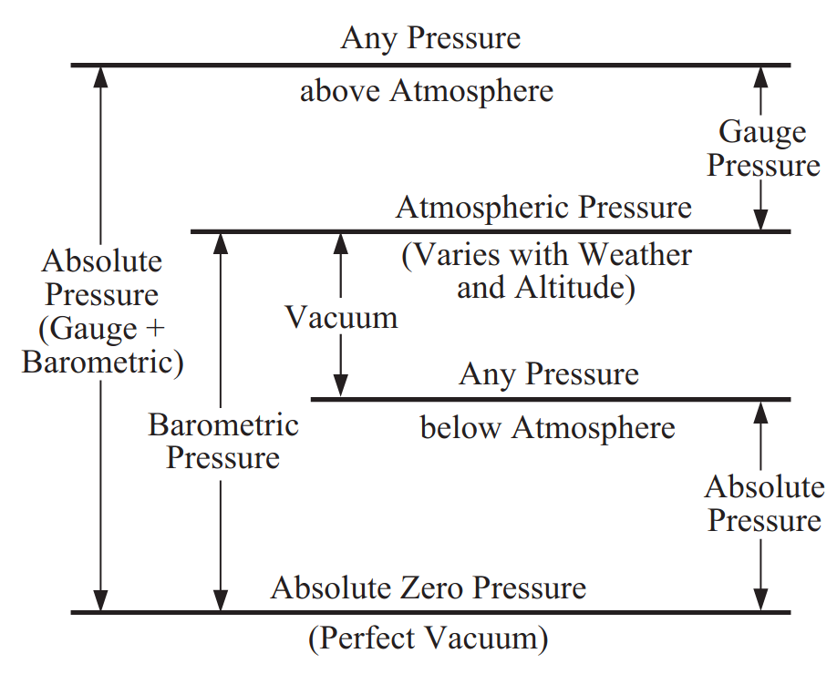
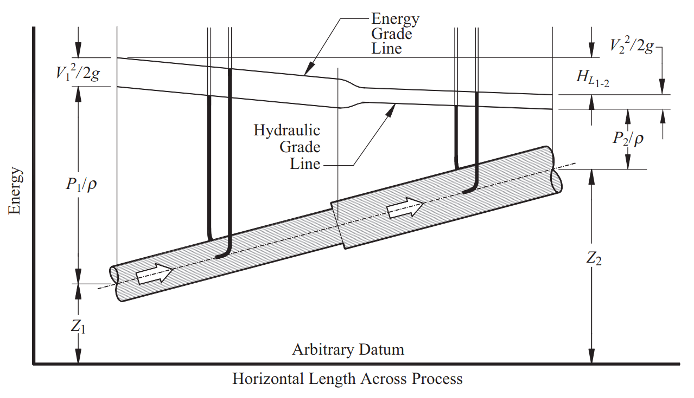
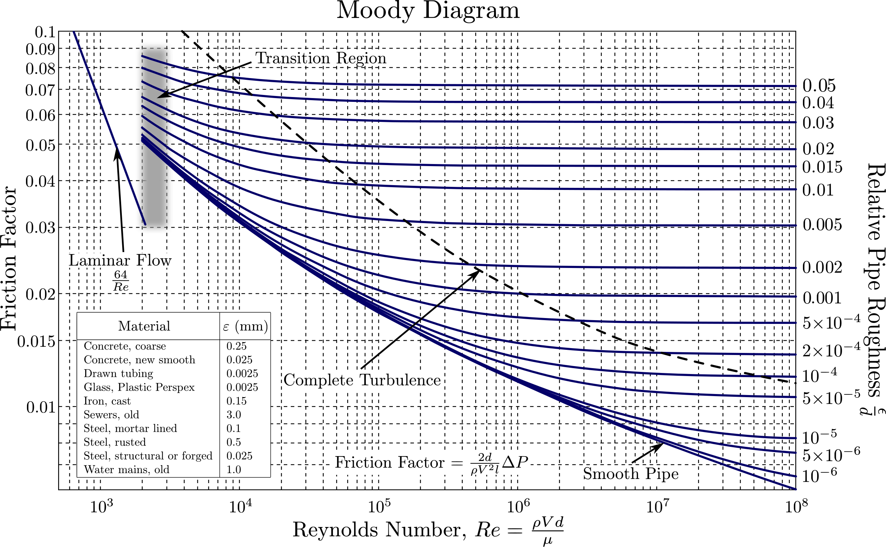

# Incompressible Pipe Flow
A succinct, summarized version of Rennel's Pipe Flow (2012) on incompressible flow in a pipe.

## Definitions
First, we'll cover some key words and definitions.

- **Critical pressure**: The pressure of a pure substance at its *critical state*; where the density of the saturated liquid is the same as the density of the saturated vapor. At pressures higher than the critical, a liquid may be heated from a low temperature to a very high one without any discontinuity indicating a change from the liquid to vapor phase.
- **Energy (work energy)**: A measure of the ability of a substance to do or absorb work. Energy may exist in five forms:
    1. Potential, owing to a substance's elevation
above an arbitrary datum
    2. Pressure, which is a measure of a fluid's ability to lift some of itself to a level above an arbitrary datum or propel some of itself to a velocity
    3. Kinetic, which resides in a substance's speed or velocity
    4. Heat, which ultimately is a measure of the kinetic energy of the molecules of a substance
    5. Work
- **Viscosity**: The resistance offered by a fluid to relative motion, or shearing, between its parts.
    - *Absolute viscosity*: The frictional or shearing force per unit area of relatively moving surfaces per unit velocity for a unit separation of the surfaces. Also called dynamic viscosity.
- **Critical temperature**: The temperature of a pure substance at its critical state, above which its gas phase cannot be liquefied by the application of pressure, because at the critical temperature the latent heat of vaporization vanishes (becomes zero) and the liquid cannot be distinguished from the gas.
- **Latent heat of vaporization**: The amount of energy (typically measured in joules per gram or kilojoules per mole) required to change a substance from the liquid phase to the gas phase at a constant temperature and pressure, without changing its temperature. It represents the energy needed to overcome the intermolecular forces holding the liquid together.

### Momentum Correction Factor
A small aside, but TLDR, if your pipe has laminar flow, you cannot use the momentum conservation equations without the correction factor $\theta \approx 1.33$.

**Motivation**: when performing control volume analysis, you typically apply conservation of mass, momentum, and energy. In pipe flow, if we assume a flat velocity profile (average velocity = velocity everywhere along the cross section), we can say that:

$$
\dot{m}V = (\rho A V)V = \rho A V^2
$$

where $V$ is the average fluid velocity. The corresponding differential equation (looking at a infinitesimal mass with local velocity $u$) is:

$$
u d\dot{m} = u^2\rho dA
$$

If we integrate this differential equation over the total cross sectional area A where the fluid velocity is **not** uniform throughout, we will arrive at a value that is **not** equal to $\dot{m}V$, and so we can account for this by saying that the integral equals $\dot{m}V$ times a correction factor:

$$
\int_{}^{} u d\dot{m} = \theta \dot{m} V
$$

where $\theta$ is the momentum flux correction factor.

### Conservation of Energy
**Units**: It is convenient to express energy in work units such as foot-pounds or newton-meters, and *unit energies* in terms of foot-pounds per pound of fluid, or newton-meters per newton. Five kinds of energy flux must be considered: potential, pressure, kinetic, heat, and work.
- Note that hence unit energies thus are in units of length!

**Potential energy**: Every unit of fluid lifted above an arbitrary datum required a certain amount of work to lift it there. If the unit of fluid quantity is pounds (or newtons), the work required (in a uniform gravity field) is its weight times the height it was lifted, ft-lb (or N-m). Thus the unit energy is ft-lb/lb or ft (or N-m/N or m), equal numerically and dimensionally to its elevation Z above the datum. This is called the elevation or *potential head*.

**Pressure energy**: Pressure is commonly expressed as force per unit area—for example, lb/in2, lb/ft2, or N/m2 (pascals). If the fluid's
pressure is divided by its weight density, its potential for doing work is expressed in potential energy terms. Consistent units will eliminate mixed unit problems. Thus:

$$
P/\rho_w = (\textrm{lb/ft}^2)/(\textrm{lb/ft}^3) = \textrm{ft}
$$

> So when we talk about pressure "**head**," we're just normalizing the pressure by the weight density.

**Kinetic energy**: The simple equations of motion show that in the absence of resistance any body dropped from one elevation to another lower elevation acquires a velocity of:

$$
V = \sqrt{2g \Delta Z}
$$

Conversely, any body moving with velocity $V$ can, if the velocity can be directed upward, attain a height of:

$$
\Delta Z = V^2/2g
$$

A fluid's energy of motion is thus $V^2/2g$ ft-lb/lb or simply ft (or N-m/N or m). This is called the *velocity head*.
- Note: just like momentum, if we have laminar flow (and therefore a parabolic velocity profile in our pipe), the kinetic energies of each particle in the pipe varies depending on their locations in the cross section. Because the square of the average is not the same as the average of the squares, a correction factor $\phi$ must be included if the average velocity is used to calculate the kinetic energy of the flowing fluid. **$\phi \approx 2.0$ for laminar flow.**

**Heat**: Heat is equivalent to work (J = N-m), and so when dealing with heat transfer rate (J/s, or just power in Watts), we can express heat in the same units of potential energy by dividing by the weight flow rate of the fluid:

$$
\left( \frac{\textrm{ft-lb/s}}{\textrm{lb/s}} \right) = \textrm{ft}
$$

Sometimes we call the conversion factor between N-m and J (or ft-lb and Btu) as $J$, and therefore you might see in textbooks:

$$
JQ = \left( \frac{\textrm{ft-lb}}{\textrm{Btu}} \right) \left( \frac{\textrm{Btu}}{\textrm{s}} \right)  = \frac{\textrm{ft-lb}}{\textrm{s}}
$$

$$
\frac{JQ}{\dot{w}} = \left( \frac{\textrm{ft-lb/s}}{\textrm{lb/s}} \right) = \textrm{ft}
$$

where $Q$ is your heat transfer rate, or power. For internal energy $U$ (of a gas), which is expressed in a per-weight basis, we can similarly use $J$ to get it in potential energy units:

$$
JU = \left( \frac{\textrm{ft-lb}}{\textrm{Btu}} \right) \left( \frac{\textrm{Btu}}{\textrm{lb}} \right)  = \textrm{ft}
$$

**Mechanical work energy**: The mechanical work $E_p$ done on the fluid in the flow system by a pump and, as in the case of heat flux, the work done by the fluid in a turbine must be expressed in power units, or work per unit time, to maintain dimensional homogeneity in the energy equation. The power from a pump is converted to potential energy units in the same way as for heat: via the weight flow rate.

---
So finally, conservation of energy in SI ($\rho$ is in mass):

$$
\frac{P}{\rho_1g} + \frac{\phi_1 V_1^2}{2g} + Z_1 + \frac{JU_1}{g} + \frac{JQ_1}{\dot{m}g} + \frac{E_p}{\dot{m}g} 
$$

$$
= \frac{P}{\rho_2g} + \frac{\phi_2 V_2^2}{2g} + Z_2 + \frac{JU_2}{g} + \frac{JQ_2}{\dot{m}g} + \frac{E_p}{\dot{m}g}
$$

If we have incompressible flow, apply conservation of mass ($\rho A v$ gives that KE stays constant), no heat transfer, pumps, and a horizontal pipe, we see that the change in pressure is directly related to a change in the internal energy of the fluid:

$$
\frac{P_1}{\rho_1} - \frac{P_2}{\rho_2} = \Delta JU
$$

$\Delta JU$ is equivalent to the change in total head, also called **head loss** $H_L$. Note that here we only see it as a change in static pressure head, but this is because the other Bernoulli terms (elevation and kinetic energy) are assumed to be zero in our *specific scenario*.
- Note that head loss is technically not a loss of total energy; it is a loss of useful mechanical energy by conversion to heat energy.

### Grade Lines
Grade lines are just a visualization of conservation of energy.
- **Energy grade line** (total head line): represents the sum of the elevation, pressure, and velocity heads. A pitot probe inserted in the flow would cause a column of the flowing fluid to rise in a manometer to that line as shown.
- **Hydraulic grade line**: it is everywhere lower than the energy grade line by the value $V^2/2g$ or the velocity head, and it is the line to which a static pressure tap will cause a column of the flowing fluid to rise.

We can see that:
- Both lines are parallel and sloping downwards due to friction
- At the sudden enlargement, there is a loss of mechanical energy caused by the turbulence it produces
- Both lines are closer to each other after the enlargement because velocity decreased
- The hydraulic grade line rises abruptly downstream of the enlargement, indicating that not all of the kinetic energy difference before and after the enlargement is lost, but some is recovered and converted to pressure energy

## Head Loss

The head loss term ($H_L$) designates the mechanical energy (embodied in the Bernoulli terms $P/\rho$, $\phi V^2/2g$, and $Z$) that is converted to thermal energy due to frictional resistance to flow.

Assuming the flow line is level ($Z_1 = Z_2$) and no external heat transfer or work (and neglecting $\phi$):

$$
\frac{P_1}{(\rho_w)_1} + \frac{V_1^2}{2g} = \frac{P_2}{(\rho_w)_2} + \frac{V_2^2}{2g} + H_L
$$

or

$$
H_L = \frac{P_1}{(\rho_w)_1} - \frac{P_2}{(\rho_w)_2} + \frac{V_1^2 - V_2^2}{2g}
$$

Assuming incompressible:

$$
H_L = \frac{P_1-P_2}{(\rho_w)}  + \frac{V_1^2 - V_2^2}{2g}
$$

> $H_L$ is a loss in total energy (energy grade line)!

### Sources of Head Loss: Friction
To reiterate, this only happens due to viscosity. Friction between the wall and fluid induces a shear force on the subsequent internal layers of the fluid, amounting to a loss in energy.

#### Laminar Flow
The Poiseuille law:

$$
H_L = \frac{32 \mu L V}{\rho_w D^2}
$$

#### Turbulent Flow
The Weisbach formula: 

$$
H_L = f \frac{L}{D} \frac{V^2}{2g}
$$

#### Friction Factor
Depends on Reynold's number and the relative roughness of the pipe. For laminar flow, $f = 64/\textrm{Re}$. For turbulent flow, use the Colebrook-White forumla:

$$
\frac{1}{\sqrt{f}} = -2 \log_{10} \left( \frac{\varepsilon/D}{3.7} + \frac{2.51}{\mathrm{Re} \sqrt{f}} \right)
$$

This requires an iterative solver, so if you're in a rush, you can use the Moody chart for the entire flow regime:

Also, you can use the Churchill formulation for an explicit formula for $f$ across all flow regimes:

$$
f = 8 \left[ \left( \frac{8}{\text{Re}} \right)^{12} + \left( A + B \right)^{-1.5} \right]^{\frac{1}{12}}
$$

$$
A = \left[ 2.457 \ln \left( \frac{1}{\left( \frac{7}{\text{Re}} \right)^{0.9} + 0.27 \frac{\varepsilon}{D}} \right) \right]^{16}
$$

$$
B = \left( \frac{37530}{\text{Re}} \right)^{16}
$$

### Sources of Head Loss: Turbulence (K-Factor)
Induced turbulence from flow obstructions (valves) or changes (bends) is referred to as *local* or *minor* losses.

$$
H_L = K \frac{V^2}{2g}
$$

$K$ ("K-factor") is a geometry-dependent constant, and so it can be said that **K is the head loss measured in units of velocity heads.**

We can see that the Weisbach equation (again, meant for turbulent frictional losses) can be written in terms of K-factor by allowing:

$$
K = f\frac{L}{D}
$$

So, we can write the head loss equation (from energy conservation) as follows:

$$
\frac{P_1 - P_2}{\rho_w} = H_L - \frac{V_1^2}{2g} \left[ 1-\left( \frac{A_1}{A_2} \right)^2 \right]
$$

or

$$
P_1 - P_2 = \frac{V_1^2\rho_w}{2g} \left[ K_1-1+\left( \frac{A_1}{A_2} \right)^2 \right]
$$

Above, the subscript $1$ indicates the inlet condition. We can also get this equation in terms of weight flow rate using the $\dot{w} = \rho_w A V$.

> For turbulent losses, though it is a function of surface roughness, the most influential parameter is Reynold's number $Re$.
